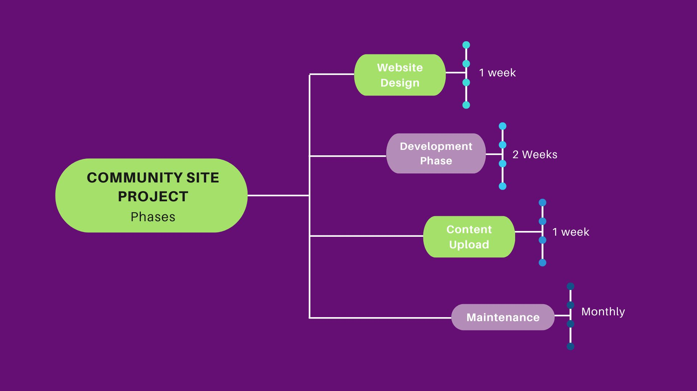

# Community Site Project Guideline
## Overview
- The Chimoney Community Site is a project that aims to recognize the contributions of the Chimoney community Members. 
- It will act as a content hub for the blog, videos, documentation and events created within the Community and by  ChiMers.

## ChiMers’ Participation Benefits
- Teamwork and collaboration skills
- Great addition to portfolio

## Resources
- Code of Conduct
- Brand Guideline

## Phases
### Website Design Stage 
- This stage  involves the UI/UX and product designers working collectively on the Community Website design for a period of **1 week**.

### Development Stage
- This stage involves converting the website design into the Chimoney Community Website and will include developers working on the static site for **2 weeks**.

### Content Creation/Upload Stage
- Once the initial Community site is done, the various contents for different sections will be added to the Community Site. 
- This stage will involve technical writers, bloggers and content creators working together to populate the site. It will take place over **1 week**.

### Maintenance Stage
- This stage will involve updating the Community Site with upcoming, past events and new content that have been created over the month.
- It will take place **monthly**.

