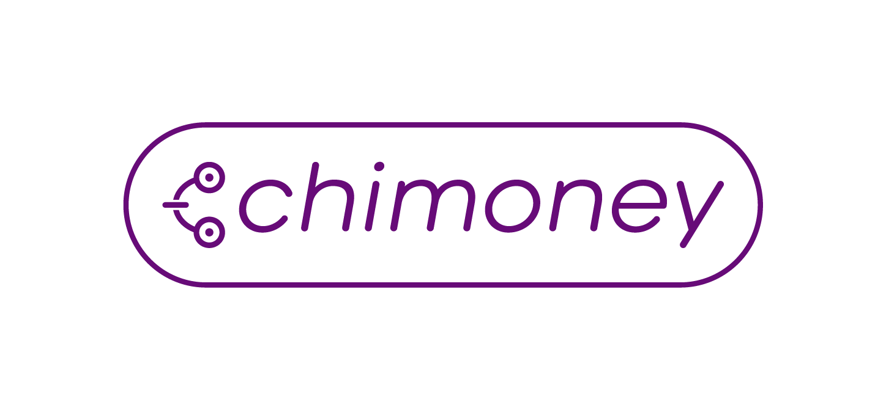

# Chimoney Community Site
A website for the Chimoney Community by the ChiMers(Chimoney Community Members). This is a content hub for the contributions and initiatives of the Chimoney
Community.

# Project Guideline
Kindly go through the [project guideline](https://github.com/Chimoney/Community-Website/blob/7a91fb7602500da19b5f8b6cdadafc4cedc0877b/PROJECT_GUIDELINE.md) before contributing.

## Sections
The site showcases different sections of content that include:

* Blogs
* Tutorials
* Events

# Design
Using the [Chimoney brand guidelines](https://docs.google.com/document/d/11Niq7-F96alud7s9S08km22MJ5bS2ZYF_xbiJSX8o4I/edit?usp=sharing), design a visual representation of the Community site design
[Figma Design](https://www.figma.com/file/TOZC54ULBuHUA1EU5tZK3k/Chimoney-Community-Website-Design-Contributions?node-id=220%3A128&t=fMbtxmVcO2YETJ1i-0)

`image`

# Code of Conduct
Please read and abide by our [Code of Conduct;](https://github.com/Chimoney/Community-Website/blob/main/CODE_OF_CONDUCT.md) 
our community aspires to be a respectful place during our online interactions.

# Contributing
We encourage contributions and particularly appreciate first-time contributors!
Please work on problems marked "first-time contributors" if you are a first-time contributor.

## Contribute via Gitpod:

## Start Contributing
1. Pick an [Issue](https://github.com/Chimoney/Community-Website/issues) and request for it to be assigned to you.
2. Fork the repo from [Chimoney-Community-Website](https://github.com/Chimoney/Community-Website)
3. Clone the forked repo with by doing `git clone https://github.com/your_username/Community-Website.git` where `your_username` is your github username.
4. Commit your Changes
5. Make a Pull Request with detailed info on your change with screenshots if possible and please tag any associated parties, @Khadeeejah @elegant1T @phyleria for a review

### Happy opensourcing :smile: !!
